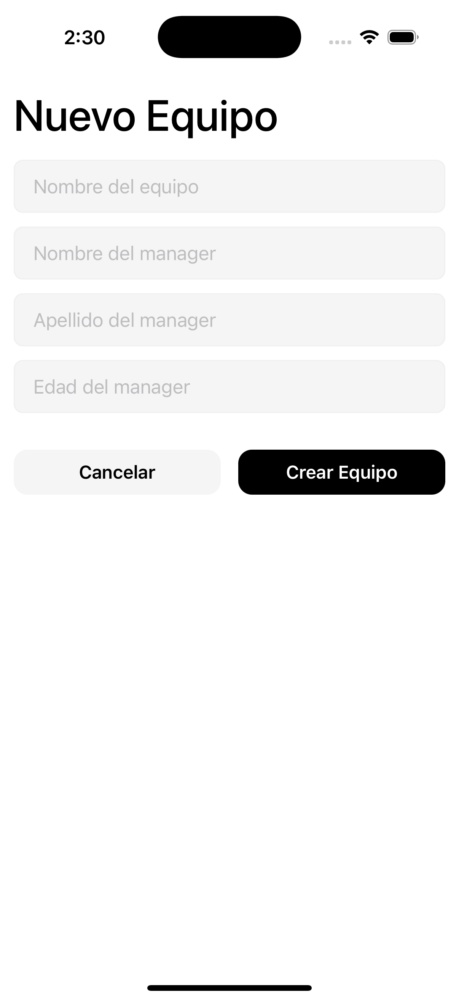

# Score

This is an app to check matches, teams, and players info of different soccer teams.

## Installation

1. **Clone the repository:**

   ```sh
   git clone https://github.com/alexsantosquispe/Score.git

   cd score
   ```

2. **Install dependencies:**

   ```sh
   npm install
   ```

3. **Set up environment variables:**

   - Copy `.env.example` to `.env` and fill in your Supabase credentials:
     ```
     EXPO_PUBLIC_SUPABASE_URL=your_supabase_url
     EXPO_PUBLIC_SUPABASE_ANON_KEY=your_supabase_anon_key
     ```

4. **Start the development server:**

   ```sh
   npm start

   and follow the instruction or scan the QR code.

   Note: You need to install Expo Go if you want to test on your phone.
   ```

## Screenshots

### Matches - Teams - Players list

<div style="display:flex; gap: 12px;">
  
  
  
  
</div>

## Main Libraries Used

- [React Native](https://reactnative.dev/)
- [Expo](https://expo.dev/)
- [Expo Router](https://expo.github.io/router/docs)
- [@tanstack/react-query](https://tanstack.com/query/latest)
- [@supabase/supabase-js](https://supabase.com/docs/reference/javascript)
- [date-fns](https://date-fns.org/)

## Features

- View soccer matches, teams, and players
- Add new teams and managers
- Search players by position

## Features in progress

- Add Players
- Create a new match and generate the info
- Check the team with highest scores
